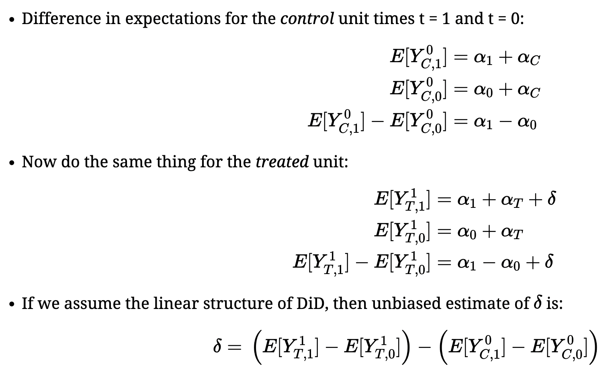
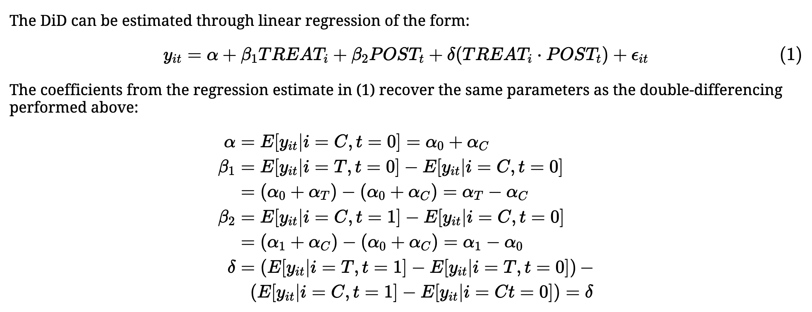
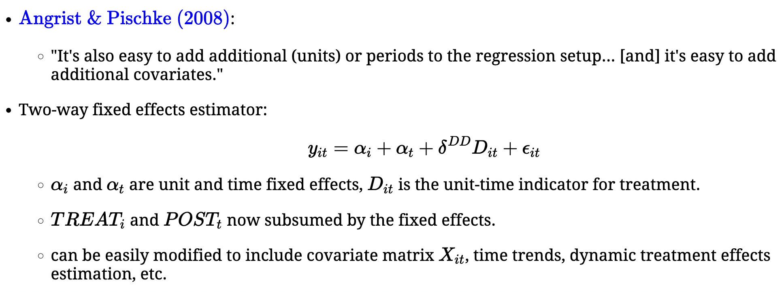
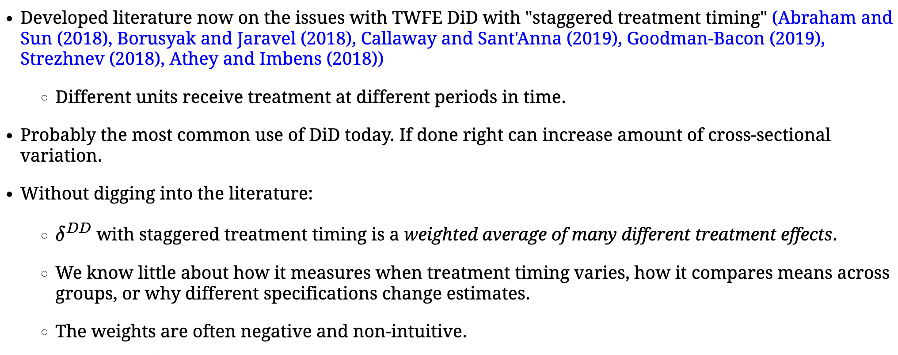

```{r setup, include=FALSE}
knitr::opts_chunk$set(warning=FALSE, message=FALSE, echo=TRUE, comment=NA, prompt=FALSE, fig.height=6, fig.width=6.5, fig.retina = 3, dev = 'svg', dev.args = list(bg = "white"), eval=TRUE)
library(tidyverse)
library(kableExtra)
```


# Outline for Day 10:

1. Implementation of DPD/GMM
1. TWFE
1. Causal Inference in Panel Data

## On Diff in Diff

A very useful paper I just ran across on Andrew Baker's website.  [This paper](https://psantanna.com/files/DiD_JEL.pdf) is a really nice practical introduction.

## Two Way Fixed Effects and Causal Inference


# Some DiD and TWFE

:::: {.columns}

::: {.column width="50%"}
DiD as the double difference [from Andrew C. Baker](https://andrewcbaker.netlify.app/did)
:::

::: {.column width="50%"}

:::

::::


## TWFE



## Equivalence




## The Problem



## A Brief Point on FEVD

Plumper and Troeger have designed a procedure to solve one of the principle problems that arises in fixed effects regressions: it is either impossible or suboptimal to estimate the effects of time-invariant or nearly time-invariant regressors.  Their approach plays off of the generic consistency of the fixed effects estimator.  In general, they begin by estimating an LSDV model. $$y_{it} = \alpha_{i} + X_{it}\beta + \epsilon_{it}$$
They then proceed to model the unit effects as a function of (largely) time-invariant regressors that they denote as $Z$
$$\alpha_{i} = Z_{i}\gamma + \psi_{i}$$ In a third stage, they then construct the regression with an offset.  In effect, they take the offset and add it to the regression such as,
$$y_{it} = \psi_{i} + X_{it}\beta + Z_{i}\gamma + \nu_{it}$$ and adjust the variance/covariance matrix of the errors accordingly.


## Glynn and Blackwell

> Repeated measurements of the same countries, people, or groups over time are vital to many fields of political 
> science.  These measurements, sometimes called time-series cross-sectional (TSCS) data, allow researchers to estimate
> a broad set of causal quantities, including contemporaneous and lagged treatment effects. Unfortunately, popular 
> methods for TSCS data can only produce valid inferences for lagged effects under very strong assumptions. In this 
> paper, we use potential outcomes to define causal quantities of interest in this settings and clarify how standard 
> models like the autoregressive distributed lag model can produce biased estimates of these quantities due to 
> post-treatment conditioning. We then describe two estimation strategies that avoid these post-treatment 
> biases-inverse probability weighting and structural nested mean models-and show via simulations that they can 
> outperform standard approaches in small sample settings.


## Imai and Kim


> Many researchers use unit fixed effects regression models as their default methods for
> causal inference with longitudinal data. We show that the ability of these models to adjust
> for unobserved time-invariant confounders comes at the expense of dynamic causal relationships,
> which are allowed to exist under an alternative selection-on-observables approach.
> Using the nonparametric directed acyclic graph, we highlight the two key causal identification
> assumptions of fixed effects models: past treatments do not directly influence current
> outcome, and past outcomes do not affect current treatment. Furthermore, we introduce
> a new nonparametric matching framework that elucidates how various fixed effects models
> implicitly compare treated and control observations to draw causal inference. By establishing
> the equivalence between matching and weighted fixed effects estimators, this framework
> enables a diverse set of identification strategies to adjust for unobservables provided that
> the treatment and outcome variables do not influence each other over time. 

## Wooldridge

Two-way fixed effects works quite well so long as we are careful about what we measure and what the fixed effects capture.

Let's focus on 3.3.

## A brief review of Mundlak

As typically written, the Mundlak estimator is presented [by Baltagi and Mundlak] as a random effects regression that must satisfy the random effects moment condition, e.g. $\mathbb{E}(\alpha_{i}X_{it}) = 0$ by including regressors capturing the time invariant unit averages.  The regression is (with K regressors):

$$y_{it} = X_{it}\beta + \overline{x}_{i}\beta_{k} + (\alpha_{i} + \epsilon_{it})
$$

where the parenthetical is the resultant error term consisting of the unit random effects and the IID error.  The general idea is to simply include the between information that could be correlated with the `fixed effects` [in econometrics language].  Mundlak shows we recover the `fixed effects` or within estimator from $\beta$.

## Two Way Mundlak

Baltagi's equation 8 [or Wooldridge 2021]

$$
y_{it} = X_{it}\beta + \overline{x}_{i}\beta_{i} + \overline{x}_{t}\beta_{t} + (\alpha_{i} + \alpha_{t} + \epsilon_{it})
$$

Baltagi's discussion on page 8 shows F tests of the unit or time averages [or both] can be used to examine whether it is the time-averaged or unit-averaged, or both, that violate the random effects moment conditions we impose.

The major contribution of Wooldridge and Baltagi is to show that OLS applied to this problem is equivalent to GLS estimation.

## Some Concluding Remarks

Plumper, et. al. 2005 point out that specification issues matter, alot.

- Absorbing cross-sectional variance by unit dummies.
- Absorbing time-series variance with lagged DV
- Lag structure matters
- Slope heterogeneity is a relevant consideration

Findings may not be at all robust.  


## My Own View

My own view of this, to borrow a phrase but use it a bit differently than the original authors, is to think of models as treatments with our data as the subject.  We make one set of assumptions and we treat our subject.  Change that around a bit and treat again.  Do it a third time and so on and so on.  In the end, we have sets of models related by subtle differences in assumptions about the process that generated the data and estimates obtained across models toward this end.  Our inferential process should be inherently Bayesian in the sense that we update the strength of conclusions on the basis of findings differing in predictable ways given these differing sets of assumptions. 

**There is no single right model or magic bullet for diagnosing an unknown data generating process.**
