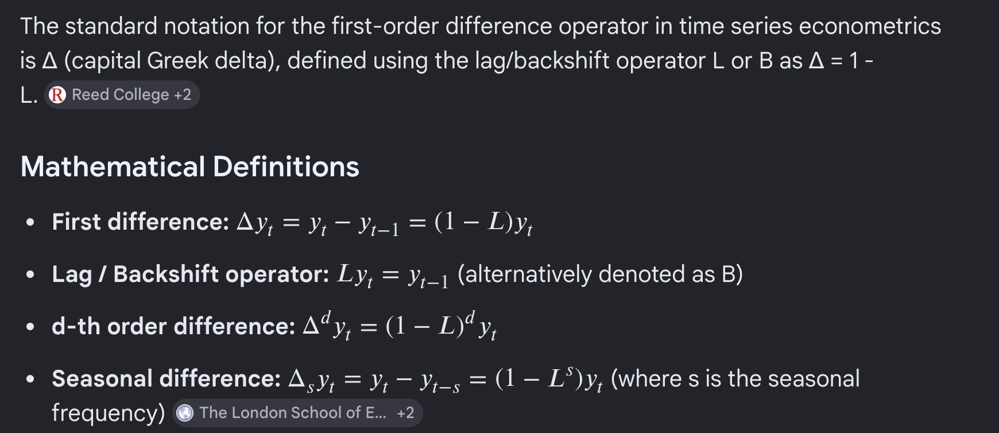
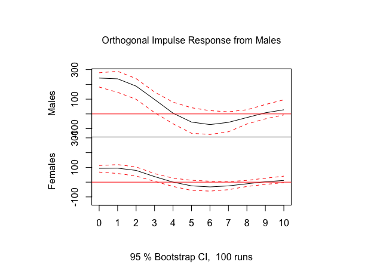
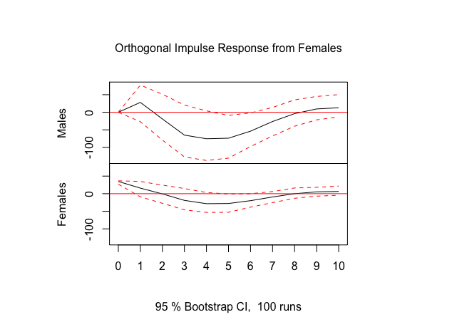

```{r setup, include=FALSE}
knitr::opts_chunk$set(
  cache = FALSE,
  echo = TRUE,
  message = FALSE, 
  warning = FALSE,
  hiline = TRUE
)
library(xaringanthemer); library(kableExtra); library(tidyverse); library(skimr)
```

# Outline for Day 3

1. A Note on Notation from Google AI
2. The Box-Jenkins Methodology
3. Dynamic Models  
4. GLS vs. OLS and fixes

## A Note on Notation from Google AI



## The Box-Jenkins ARIMA Approach

B-J modeling strategy starts with **(p, d, q)** diagnostics:

$$e_{t} = \phi_{1} e_{t-1} + \phi_{2}e_{t-2} + \cdots + \phi_{p} e_{t-p} + \nu_{t} + \theta_{1} \nu_{t-1} + \theta_{2}\nu_{t-2} + \cdots + \theta_{q} \nu_{t-q}$$

::: {.incremental}
1. **Determine Stationarity** through a three-pronged strategy:
   1. Graph $Y_t$ across time
   2. Examine the ACF and PACF
   3. Conduct a statistical test for stationarity (e.g., Augmented Dickey-Fuller)

2. **Diagnose the AR and the MA processes**

3. **Post-estimation diagnostics** of the residuals from a filtering model — if we have the B-J model right, $\hat{\epsilon}$ should be pure random noise.
:::

## Portmanteau Tests for White Noise

Goal: White noise residuals -- that is, residuals that contain no notable autocorrelation.

- Measure: **Portmanteau tests** are encompassing tests for white noise in a model's residuals. One of the most popular is the **Ljung-Box Q-statistic**.

- If $Y$ is white noise, then (because correlations are distributed normal, their squares are chi-square):

$$Q = n(n+2)\sum_{j=1}^{m} \frac{1}{n-j}\hat{\rho}_j^2 \;\rightarrow\; \chi^2_m$$

- where $m$ is the number of autocorrelations calculated (based on the number of lags specified) and $\hat{\rho}_j$ is the estimated autocorrelation for lag $j$.

::: {.callout-note}
**Larger Q-statistics** indicate that the errors contain some type of systematic process.
::: 

## Stata's `corrgram` Output — An Example

```
LAG    AC       PAC      Q         Prob>Q
  1    0.9458   0.9706   92.164    0.0000
  2    0.8932  -0.0238   175.21    0.0000
  3    0.8523   0.0585   251.59    0.0000
  4    0.8224   0.0526   323.45    0.0000
  5    0.7907   0.0027   390.57    0.0000
  6    0.7457  -0.2053   450.91    0.0000
  7    0.6980  -0.1496   504.35    0.0000
  8    0.6604  -0.0166   552.70    0.0000
  9    0.6229  -0.1212   596.19    0.0000
 10    0.5862  -0.0934   635.14    0.0000
 ...
 40   -0.4325  -0.5224  1035.50    0.0000
```

::: {.callout-note}
Slowly decaying AC values and a single large PAC spike at lag 1 are the hallmark of a non-stationary (unit root) process.
:::

## Logging Time Series Variables

- Logging variables is a frequently-recommended way to deal with the **variance-non-stationarity** of a variable.

- In practice this doesn't usually make much of a difference.

- Of course if you have done this, you need to keep this in mind when interpreting your results.

## Detecting AR and MA Processes

| Model | ACF | PACF |
|---|---|---|
| White noise | All zero | All zero |
| MA(1): $\theta > 0$ | Single positive spike at lag 1 | Oscillating decay |
| MA(1): $\theta < 0$ | Single negative spike at lag 1 | Geometric decay |
| AR(1): $\phi_1 > 0$ | Direct geometric decay | Single spike at lag 1 |
| AR(1): $\phi_1 < 0$ | Oscillating decay | Single spike at lag 1 |
| AR(p) | Decays toward zero | Spikes through lag p; zero for $s > p$ |
| ARMA(1,1) | Geometric decay after lag 1 | Oscillating decay after lag 1 |
| ARMA(p,q) | Decay after lag q | Decay after lag p |

: Properties of the ACF and PACF (after Enders Table 2.1) {.striped}

## Detecting AR and MA Processes — Rules of Thumb

- **Pure AR processes** generally lead to declining ACFs and spikes in the PACF to indicate the ordering.

- **Pure MA processes** show the opposite — a spike in the ACF and a declining pattern in the PACF.

- **Combinations** (non-pure ARMA) are more difficult to diagnose.

- A **single spike in both the ACF and PACF** can usually be modelled well by an MA at that lag.

- Any **declining pattern in the ACF** indicates an AR process starting at the lag at which the initial spike appears.

::: {.callout-tip}
Always keep in mind that we are moving from a position of ignorance. Significant results in the ACF and PACF may arise **purely by chance**.
:::

---

## ARIMA PDQ Notation

A univariate time series can be characterised as **ARIMA(p, d, q)** where:

- **d** is the number of differences
- **p** is the number of AR terms
- **q** is the number of MA parameters

Once we know (p, d, q) for a particular series, we can write it out. For instance, if $Y_t$ is ARIMA **(1, 1, 1)**:

$$(1-L)Y_t = \phi(1-L)Y_{t-1} + \epsilon_t + \theta\epsilon_{t-1}$$

## Invertibility

- The Box-Jenkins approach requires that a variable be **stationary** and **invertible**.

- This is why we start out determining whether or not the series is stationary.

- A time series is said to be **"invertible"** if it can be represented by a finite-order or convergent autoregressive process.

---

## Filtering Models

Once we think we have the right (p, d, q) model, we test it with a **filtering model**.

- Estimate using **MLE** and examine the parameter estimates and the ACF, PACF, and Q statistics for the model residuals.
- If we see **pure white noise** in the residuals, we have a good model. If not, re-specify until we do.
- Another acid test is the model's **ability to forecast** — ex-post forecasting is a good way to settle disputes between rival models.
- We can also use **AIC** and other model selection criteria.
- There could be more than one model that provides the desiderata.
---

## Model Selection Criteria

One critique of $R^2$ is that it can only go up with the addition of new variables. Penalty-based criteria build in parsimony.

**Adjusted $R^2$:**
$$\bar{R}^2 = 1 - \frac{n-1}{n-K}(1-R^2)$$

**Akaike Information Criterion (AIC):**
$$\text{AIC}(K) = s_y^2(1-R^2)\,e^{2K/n}$$

**Bayesian Information Criterion (BIC / Schwartz criterion):**
$$\text{BIC}(K) = s_y^2(1-R^2)\,n^{K/n}$$

For information criteria: **smaller values indicate better-fitting, more parsimonious models**.  It is often suggested that AIC has better properties for forecasting models while BIC (generally) has a more extreme penalty for each parameter leading to more parsimonious explanations.

---

## Fractional Integration (Discussed in Chapter 7)

Starting from:
$$Y_t - Y_{t-1} = \epsilon_t \;\;\Longrightarrow\;\; (1-L)Y_t = \epsilon_t \;\;\Longrightarrow\;\; (1-L)^1 Y_t = \epsilon_t$$

We can generalise by allowing **d to take non-integer values**:

$$(1-L)^d Y_t = \epsilon_t$$

| Value of **d** | Process type |
|---|---|
| $-0.5 < d < 0$ | Anti-persistent, stationary |
| $0 < d < 0.5$ | Long-memoried, **stationary** (mean-reverting) |
| $0.5 \leq d < 1$ | Long-memoried, **non-stationary** |
| $d = 1$ | Classic unit root (random walk) |

---

## ARFIMA

- The **ARFIMA** model generalises the ARIMA model by allowing **non-integer degrees of integration**.

- ARFIMA models provide a solution for the tendency to **over-difference** stationary series that exhibit long-run dependence.

- In the standard ARIMA approach, $d$ is constrained to integers (0, 1, 2, …). Many series exhibit too much dependence to be I(0) but are not I(1) — ARFIMA captures this middle ground.

- Such series are said to be **integrated of order d**, denoted I(d).

---

## ARFIMA, continued

The standard ARIMA model in lag-operator notation:

$$(1-L)Y_t = \frac{\theta(L)}{\phi(L)}\epsilon_t$$

The **ARFIMA** generalisation:

$$(1-L)^d Y_t = \frac{\theta(L)}{\phi(L)}\epsilon_t$$

where $d$ can now range continuously from $-0.5$ to $1$ (and beyond).

- Previously we used integer values: $d \in \{0, 1, 2\}$.
- ARFIMA allows $d$ to take values across the full range, with key regions at $(-0.5, 0)$, $(0, 0.5)$, and $(0.5, 1)$.
- This is the **ARFIMA** model, where "FI" stands for **Fractional Integration**.

A simple special case — the **Pure Fractional Noise** model:

$$(1-L)^d Y_t = \epsilon_t, \quad \epsilon_t \sim N(0, \sigma^2)$$

Lebo, Walker, and Clarke (2000) provide evidence that many political time series are consistent with fractional integration.

## Interventions Generally

- Interventions or "impact assessments" are a popular extension of ARIMA modeling.

- In the most basic models of interventions, we are testing a theory about the impact of a **single event** on our dependent variable of interest.

- If we start out with a stationary dependent variable ($Y_t$), we can write an intervention model compactly as:

$$Y_t = f(I_{t-i}) + N_t$$

where:

- $I_{t-i}$ is the **intervention component**,
- $i$ represents your expectation of **when** the intervention takes effect, and
- $N_t$ is the **noise model** (AR and MA terms).

---

## Interventions Generally (cont.)

Interventions in time series can be characterised by **two dimensions**:

- **Dynamics**: abrupt vs. gradual
- **Duration**: temporary vs. permanent

. . .

Interventions can also be written generally as:

$$Y_t = \frac{\omega_0}{1 - \delta L}\, I_{t-i} + N_t$$

where $\delta$ is known as the **"adjustment parameter"**.

- The four types of intervention are determined by the values of $I_{t-i}$ and $\delta$.
- A typical restriction is that $|\delta| < 1$.
- Negative values of $\delta$ are particularly odd and imply model misspecification.
- Thus $\delta$ should usually be between $0$ and $+1$.
  - Larger values indicate the adjustment takes longer to play out.
- If $\delta = 0$, the intervention is **abrupt**: impact occurs entirely in the period $t - i$.

---

## Permanent Interventions

For permanent intervention effects, $I_t = 0$ before the event and $I_t = 1$ thereafter.

> E.g., $I_t$: `00000000011111111111`

This formulation of $I_t$ is also called a **step function**.

. . .

**Abrupt permanent intervention** (stationary $Y_t$, $\delta = 0$):

$$Y_t = \omega_0 I_{t-i} + N_t$$

This is a special case of the general model with $\delta = 0$.

. . .

If we keep the same step-function $I_t$ but set $1 > \delta > 0$, we have a **gradual permanent intervention**.

---

## Temporary Interventions

For temporary intervention effects, $I_t = 0$ before the event, $I_t = 1$ at the time of the event, and $I_t = 0$ thereafter.

> E.g., $I_t$: `00000000010000000000`

. . .

**Abrupt temporary intervention** (stationary $Y_t$, $\delta = 0$):

$$Y_t = \omega_0 I_{t-i} + N_t$$

This is again the general model with $\delta = 0$.

. . .

If we keep the same impulse $I_t$ but set $0 < \delta < 1$, we have a **gradual temporary intervention**.

---

## Understanding Delta

Starting with the general formula for an ARIMA(0,0,0) $Y_t$ (setting $i = 0$ and ignoring the noise term):

$$Y_t = \frac{\omega_0}{1 - \delta L}\, I_t$$

Multiply both sides by $(1 - \delta L)$:

$$(1 - \delta L)\,Y_t = \omega_0 I_t$$

Expanding the lag operator:

$$Y_t - \delta Y_{t-1} = \omega_0 I_t$$

$$\boxed{Y_t = \delta\, Y_{t-1} + \omega_0 I_t}$$

This reveals $Y_t$ as an AR(1) process driven by the intervention: each period's value depends on the previous period scaled by $\delta$, plus the current intervention impulse.

---

## Four Intervention Types

```{r}
#| echo: false
#| warning: false
#| message: false
#| fig-width: 10
#| fig-height: 6

library(ggplot2)
library(patchwork)

time  <- 0:20
T_int <- 11     # period of intervention onset
omega <-  5

# Abrupt Temporary: impulse, delta = 0
Y1 <- ifelse(time == T_int, omega, 0)

# Abrupt Permanent: step, delta = 0
Y2 <- ifelse(time >= T_int, omega, 0)

# Gradual Temporary: impulse, delta = 0.5
Y3 <- numeric(length(time))
for (t in seq_along(time)[-1]) {
  Y3[t] <- 0.5 * Y3[t - 1] + omega * (time[t] == T_int)
}

# Gradual Permanent: step, delta = 0.9, omega = 1  =>  LR effect = 10
Y4 <- numeric(length(time))
for (t in seq_along(time)[-1]) {
  Y4[t] <- 0.9 * Y4[t - 1] + 1 * (time[t] >= T_int)
}

df <- data.frame(time, Y1, Y2, Y3, Y4)

blue <- "#4169E1"
th   <- theme_minimal(base_size = 12) +
  theme(panel.grid.minor = element_blank(),
        plot.title = element_text(size = 11, face = "bold"))

p1 <- ggplot(df, aes(time, Y1)) +
  geom_line(colour = blue) + geom_point(colour = blue, size = 2) +
  labs(title = "Abrupt Temporary", x = "time", y = "Y1") + th

p2 <- ggplot(df, aes(time, Y2)) +
  geom_line(colour = blue) + geom_point(colour = blue, size = 2) +
  labs(title = "Abrupt Permanent", x = "time", y = "Y2") + th

p3 <- ggplot(df, aes(time, Y3)) +
  geom_line(colour = blue) + geom_point(colour = blue, size = 2) +
  labs(title = "Gradual Temporary", x = "time", y = "Y3") + th

p4 <- ggplot(df, aes(time, Y4)) +
  geom_line(colour = blue) + geom_point(colour = blue, size = 2) +
  labs(title = "Gradual Permanent", x = "time", y = "Y4") + th

(p1 + p2) / (p3 + p4)
```

---

## Temporary Gradual Intervention: Effect of $\delta$

```{r}
#| echo: false
#| warning: false
#| message: false
#| fig-width: 10
#| fig-height: 5.5

library(dplyr)
library(purrr)

time  <- 0:20
T_int <- 11
omega <- 5

deltas <- c(0, 0.1, 0.5, 0.9, 1)
labels <- c("delta = 0", "delta = .1", "delta = .5", "delta = .9", "delta = 1")
cols   <- c("#4169E1", "#8B0000", "#228B22", "#FFA500", "#708090")

results <- map2_dfr(deltas, labels, function(d, lab) {
  Y <- numeric(length(time))
  for (t in seq_along(time)[-1]) {
    Y[t] <- d * Y[t - 1] + omega * (time[t] == T_int)
  }
  data.frame(time = time, Y = Y, delta = lab, stringsAsFactors = FALSE)
}) |>
  mutate(delta = factor(delta, levels = labels))

ggplot(results, aes(time, Y, colour = delta, group = delta)) +
  geom_line(linewidth = 0.9) +
  geom_point(size = 2.5) +
  scale_colour_manual(values = cols, name = NULL) +
  labs(x = "time", y = NULL,
       title = "Temporary Gradual Intervention With Different Deltas") +
  theme_minimal(base_size = 13) +
  theme(legend.position = "bottom",
        panel.grid.minor = element_blank())
```

---

## Permanent Gradual Intervention: Effect of $\delta$

```{r}
#| echo: false
#| warning: false
#| message: false
#| fig-width: 10
#| fig-height: 5.5

time  <- 0:20
T_int <- 11
omega <- 1      # long-run effect = omega / (1 - delta)

deltas <- c(0, 0.1, 0.5, 0.9, 1)
labels <- c("delta = 0", "delta = .1", "delta = .5", "delta = .9", "delta = 1")
cols   <- c("#4169E1", "#8B0000", "#228B22", "#FFA500", "#708090")

results2 <- map2_dfr(deltas, labels, function(d, lab) {
  Y <- numeric(length(time))
  for (t in seq_along(time)[-1]) {
    Y[t] <- d * Y[t - 1] + omega * (time[t] >= T_int)
  }
  data.frame(time = time, Y = Y, delta = lab, stringsAsFactors = FALSE)
}) |>
  mutate(delta = factor(delta, levels = labels))

ggplot(results2, aes(time, Y, colour = delta, group = delta)) +
  geom_line(linewidth = 0.9) +
  geom_point(size = 2.5) +
  scale_colour_manual(values = cols, name = NULL) +
  labs(x = "time", y = NULL,
       title = "Permanent Gradual Intervention With Different Deltas") +
  theme_minimal(base_size = 13) +
  theme(legend.position = "bottom",
        panel.grid.minor = element_blank())
```

*Note: For $\delta = 1$ the step input induces a random walk (no long-run equilibrium).*

---

## Alternative Specification of Gradual Interventions

It is also possible to model a gradual intervention while keeping $\delta = 0$:

$$Y_t = \omega_0 I_{t-i} + N_t$$

Instead of estimating $\delta$, we **construct** a ramp directly in $I_t$.

> E.g., $I_t$: `0  0  0  .25  .5  .75  1  0  0  0`

. . .

**Caution**: this approach imposes strong metric assumptions about the *shape* and *timing* of the transition — assumptions that are baked into the variable construction rather than estimated from the data.

---

## Enders (2004) Figure 5.3: Typical Intervention Patterns

Four canonical shapes (Enders, *Applied Econometric Time Series*, Figure 5.3):

| Panel | Label | Input | $\delta$ | Description |
|:---:|:---|:---:|:---:|:---|
| (a) | **Pure jump** | Step | $0$ | Abrupt permanent |
| (b) | **Pulse** | Impulse | $0$ | Abrupt temporary |
| (c) | **Gradually changing** | Step | $>0$ | Gradual permanent |
| (d) | **Prolonged pulse** | Impulse | $>0$ | Gradual temporary |

The table maps directly onto the two-dimensional classification: **dynamics** (abrupt/gradual) × **duration** (temporary/permanent).

---

## Steps in a Simple Intervention Model

To model the impact of an intervention we first need a **noise model** for $Y_t$ — but because we believe an intervention is present, this is potentially problematic.

. . .

**Enders' recommendation**: Build the noise model using the *longer* of the two sub-series created by splitting the data at the point of the intervention $I_{t-i}$.

. . .

**Alternative approach**: Privilege the intervention variable —

1. Place the intervention on the right-hand side of a model with $Y_t$ made stationary.
2. Build the noise model from the **residuals** of that model.

There are multiple valid approaches; the key is not to let the intervention period contaminate the ARIMA identification step.

---

## Differencing with Interventions

So far we have assumed a stationary $Y_t$. If $Y_t$ is non-stationary and must be differenced, **the intervention measure $I_t$ must also be differenced**.

. . .

Consider a permanent (step) intervention:

$$(1 - L)\,Y_t = \omega_0 I_t + \epsilon_t$$

$$Y_t - Y_{t-1} = \omega_0 I_t + \epsilon_t$$

$$Y_t = Y_{t-1} + \omega_0 I_t + \epsilon_t$$

. . .

**The problem**: we have differenced $Y_t$ but *not* $I_t$. This introduces a **random walk with drift** when we actually want a **random walk with a level shift**. The intervention must be differenced to maintain consistency with the dependent variable transformation.

---

## Transfer Functions: Overview

**Box-Jenkins transfer function models** extend the ARIMA framework to models with continuous independent variables.

- This approach requires a strict assumption: the independent variable must be **truly exogenous**.
- When this holds, shocks to the independent variable *transfer* to the dependent variable — hence the name.

. . .

In transfer function modelling, you either:

- Assume a **pure random noise** error term for the independent variable, **or**
- Incorporate a **filtering model** for it as well *(not currently available in Stata).*

. . .

A central challenge: determining the **appropriate lag** at which to specify each independent variable.

---

## What Is the Appropriate Lag?

Consider the model:

$$\Delta GOVPOPL_t = \omega_1 FALK_t + \omega_2 EMPXL_{t-i} + N_t$$

Different theories imply different values of $i$:

| $i$ | Mechanism |
|:---:|:---|
| $0$ | "Market/me" — informational effect is **immediate** |
| $1$ | **Media disclosure** of economic measures |
| $2$ | **Diffuse social network** ("mates") transmission |

---

## Determining the Lag: Two Strategies

**Strategy 1 — Theory-driven**

Use substantive knowledge about the underlying causal process to set $i$ a priori.

. . .

**Strategy 2 — Data-driven identification**

Let the data guide lag specification through:

- **Pre-whitening**, and
- **Cross-correlation**.

---

## Pre-Whitening

Pre-whitening controls for serial autocorrelation before examining cross-correlations:

1. Identify and fit the **univariate ARIMA model** for the independent variable $X_t$; save the residuals $\hat{\alpha}_t$.

2. Apply the **same ARIMA filter** to the dependent variable $Y_t$; save those residuals $\hat{\beta}_t$.

3. **Cross-correlate** $\hat{\alpha}_t$ and $\hat{\beta}_t$ to reveal the lag structure free of autocorrelation contamination.

. . .

> **Software note**: RATS handles pre-whitening for AR (linear) specifications but not for MA (non-linear) processes. A second-best approach is to filter $Y_t$ using its *own* univariate ARIMA and then cross-correlate with the pre-whitened $X_t$.

---

## Cross-Correlation

$$\Delta GOVPOPL_t = \omega_1 FALK_t + \omega_2 EMPXL_{t-i} + N_t$$

Suppose we expect the effect of unemployment ($EMPXL$) to be **negative** and believe $i < 4$ (effect materialises within one quarter).

**Procedure**:

1. Correlate $EMPXL_t$ with $GOVPOPL$ at lags $t$, $t+1$, $t+2$, $t+3$.
2. Select the lag at which the **largest negative correlation** occurs.
3. Use that lag as $i$ in the transfer function model.

This data-driven identification strategy is known as **cross-correlation**.

This complete analysis and the original article can be found on [Box](https://essexuniversity.box.com/s/lgh3u90i6aajdcphga1x2iyy8zcf0ig9)

## Dynamic Linear Models

The ARIMA approach is fundamentally inductive.  The workflow involves the use of empirical values of ACFs and PACFs to engage in model selection.  Dynamic models engage theory/structure to impose more stringent assumptions for producing estimates.

## Time Series Linear Models/Dynamic Models

First, a result.  **Aitken Theorem**

In a now-classic paper, Aitken generalized the Gauss-Markov theorem to the class of Generalized Least Squares estimators.  It is important to note that these are GLS and not FGLS estimators.  What is the difference?  The two GLS estimators considered by Stimson are not strictly speaking GLS.

Definition $$\hat{\beta}_{GLS} = (\mathbf{X}^{\prime}\Omega^{-1}\mathbf{X})^{-1}\mathbf{X}^{\prime}\Omega^{-1}\mathbf{y}$$
> Properties 
>  
> (1) GLS is unbiased.  
> (2) Consistent.  
> (3) Asymptotically normal.  
> (4) MV(L)UE


## A Quick Example

The variance/covariance matrix of the errors for a first-order autoregressive process is useful to derive.  

1. The matrix is banded; observations separated by one point in time are correlated $\rho$.  Period two is $\rho^2$; the corners are $\rho^{T-1}$.  The diagonal is one.  


1. What I have actually described is the correlation; the relevant autocovariances are actually defined by $\frac{\sigma^{2}\rho^{s}}{1 - \rho^2}$ where $s$ denotes the time period separation.  


1. It is also straightforward to prove (tediously through induction) that this is invertible; it is square and the determinant is non-zero having assumed that $|\rho < 1|$.  
   -  The $2x2$ determinant is $\frac{1}{1-\rho^2}$.  
   -  The $3x3$ is $1*(1-\rho^2) - \rho(\rho - \rho^3) + \rho^2(\rho^2 - \rho^2)$.  The first term is positive and the second term is non-zero so long as $\rho \neq 0$.  But even if $\rho=0$, we would have an identity matrix which is invertible.


$$\Phi = \sigma^{2}\Psi = \sigma^{2}_{e}  \left(\begin{array}{ccccc}1 & \rho^{1} & \rho^{2} & \ldots & \rho^{T-1} \\ \rho^1 & 1 & \rho^1 & \ldots & \rho^{T-2} \\ \rho^{2} & \rho^1 & 1 & \ldots & \rho^{T-3} \\ \vdots & \vdots & \vdots & \ddots & \vdots \\ \rho^{T-1} & \rho^{T-2} & \rho^{T-3} & \ldots & 1 \end{array}\right)$$

given that $e_{t} = \rho e_{t-1} + \nu_{t}$.  A Toeplitz form....

If the variance is stationary, we can rewrite,
$$\sigma^{2}_{e} = \frac{\sigma^{2}_{\nu}}{1 - \rho^{2}}$$

A comment on characteristic roots....

## Cochrane-Orcutt

We have the two key elements to implement this except that we do not know $\rho$; we will have to estimate it and estimates have uncertainty.  But it is important to note this imposes exactly an AR(1).  If the process is incorrectly specified, then the optimal properties do not follow.  Indeed, the optimal properties also depend on an additional important feature.


## What does the feasible do?

We need to estimate things to replace unknown covariance structures
and coverage will depend on properties of the estimators of these
covariances.  

- Consistent estimators will work but there is
euphemistically `considerable variation` in the class of consistent
estimators.  

- Contrasting the Beck and Katz/White approach with the GLS
approach is a valid difference in philosophies.[^a]  One takes advantage of OLS and Basus Theorem; one goes full Aitken.

[^a]: We will return to this when we look at Hausman because this is the essential issue.


## Incremental Models

$$y_{t} = a_{1} y_{t-1} + \epsilon_{t}$$

is the simplest dynamic model but it cannot be estimated consistently, in general terms, in the presence of serial correlation.  **Why?**

The key condition for unbiasedness is violated because $\mathbb{E}(y_{t-1}\epsilon_{t}) \neq 0$.  OLS will not generally work.

**A note on dynamic interpretation.**


## Incremental Models with Covariates

$$y_{t} = a_{1} y_{t-1} + \beta X_t + \epsilon_{t}$$

The problem is fitting and the key issue is white noise residuals post-estimation.  But we have to assume a structure and implement it.


## Distributed Lag Models

$$y_{t} = \alpha + \beta_{0} X_t + \beta_{1}x_{t-1} + \ldots + \epsilon_{t}$$

The impact of $x$ occurs over multiple periods.  It relies on theory, or perhaps analysis using information criteria/F [owing to quasi-nesting and missing data].  OLS is a fine solution to this problem but the search space of models is often large.

In response to this problem, we have structured distributed lag models; there are many such schemes.

- Koyck/Geometric decay:  
short run and long-run effects are parametrically identified
$$y_t = \alpha + \beta(1-\lambda)\sum_{j=0}^{\infty}\lambda^{j}X_{t-j} + \epsilon$$

- Almon (more arbitrary decay)
$$y_{it} = \sum_{t_{A}=0}^{T_{F}} \rho_{t_{A}}x_{t - t_{A}} + \epsilon_{t}$$ with coefficients that are ordinates of some general polynomial of degree $T_{F} >> q$.  The $\rho_{t_{A}} = \sum_{k=0}^{T_{F}} \gamma_{k}t^{k}$.

## Autoregressive Distributed Lag Models

$$y_{t} = \alpha + \gamma_{1}y_{t-1} + \beta_{0} X_t + \beta_{1}X_{t-1} + \beta_{2}X_{t-2} + \ldots + \epsilon_{t}$$

- OLS is often used if iid; $\epsilon_{t}$ is unrelated to $y_{t-1}$ is common if nonsensical.
- If not iid: GLS is needed.
- The authors argue that the lagged dependent variable often yields white noise for free.  As they also note, there is a deBoef and Keele paper showing the relationship between these models and a form of error correction models.  More on that tomorrow.
- There is substance to the timing of impacts.

## A Cottage Industry of ADL's

As recently as April of 2025, a paper appeared in the *Journal of Politics* advocating the use of ADL(2,2).  The paper, by Kagalwala and Whitten, called **The Answer was There All Along: Worry about the dynamics!**. A previous argument was made for the ADL(1,1) a few years before.  I have placed the 2025 paper in the Box.

## Structural vs. Non-structural

Data analysis can quite yield models comparisons among competing dynamic structures.  The key issue is that the analyst need divine the process; what is the relevant error process and what is the structure and timing of effects alongside the potential question of incremental adjustment.  We need good theory for that.

Given such theory, we can take an equations as analysis approach, measure the variables, and derive reduced forms, and then recover parameter estimates deploying simultaneous equations methods.  Very large such systems were a core part of early empirical macroeconomics.  The failures of such systems led to the proposal of alternatives.

Chris Sims suggested a more flexible approach: the VAR.  


## VAR: Vector AutoRegression

- Choose a relevant set of lag lengths and write each variable in the system as a function of lags of itself and other variables to the chosen lengths.<sup>1</sup> [For Stata](https://www.stata.com/manuals/tsvar.pdf) and [for R](https://otexts.com/fpp3/VAR.html)[^1]

[^1]: A nice blog post with an extended example in R can be found on [towardsdatascience](https://medium.com/data-science/a-deep-dive-on-vector-autoregression-in-r-58767ebb3f06).  Kit Baum has [a similar worked example in slides](http://fmwww.bc.edu/EC-C/S2016/8823/ECON8823.S2016.nn10.slides.pdf).

- The key insight is that this VAR is the reduced form to some more complicated as yet unspecified structural form.  


- But if the goal is to specify how variables related to one another and to use data to discover Granger causality and responses to impulse injected in the system.


## A very simple example

```
library(forecast)
mdeaths
fdeaths
save(mdeaths, fdeaths, file = "./img/LungDeaths.RData")
```

```{r, eval=FALSE}
library(hrbrthemes)
load(url("https://github.com/robertwwalker/Essex-Data/raw/main/LungDeaths.RData"))
Males <- mdeaths; Females <- fdeaths
Lung.Deaths <- cbind(Males, Females) %>% as_tsibble()
Lung.Deaths %>% autoplot() + theme_ipsum_rc()
```

##

```{r, echo=FALSE, fig.width=6, fig.height=3.5}
library(hrbrthemes); library(fpp3)
load(url("https://github.com/robertwwalker/Essex-Data/raw/main/LungDeaths.RData"))
Males <- mdeaths; Females <- fdeaths
Lung.Deaths <- cbind(Males, Females) %>% as_tsibble()
Lung.Deaths %>% autoplot() + theme_ipsum_rc() + labs(y="Lung Deaths", x="Month [1M]", title="Lung Deaths among Males and Females") + guides(color="none")
```

## a VAR

:::: {.columns}

::: {.column width="50%"}
```{r, eval=FALSE}
lung_deaths <- cbind(mdeaths, fdeaths) %>%
  as_tsibble(pivot_longer = FALSE)
fit <- lung_deaths %>%
  model(VAR(vars(mdeaths, fdeaths) ~ AR(3)))
report(fit)
```
:::

::: {.column width="50%"}
```{r, echo=FALSE}
lung_deaths <- cbind(mdeaths, fdeaths) %>%
  as_tsibble(pivot_longer = FALSE)
fit <- lung_deaths %>%
  model(VAR(vars(mdeaths, fdeaths) ~ AR(3)))
report(fit)
```
:::

::::

##

:::: {.columns}

::: {.column width="50%"}
```{r, eval=FALSE}
fit2 <- lung_deaths %>%
  model(VAR(vars(mdeaths, fdeaths) ~ AR(2)))
report(fit2)
```
:::

::: {.column width="50%"}
```{r, echo=FALSE}
fit2 <- lung_deaths %>%
  model(VAR(vars(mdeaths, fdeaths) ~ AR(2)))
report(fit2)
```


```{r, fig.width=6, fig.height=3}
fit %>%
  fabletools::forecast(h=12) %>%
  autoplot(lung_deaths)
```
:::

::::


## Female

:::: {.columns}

::: {.column width="50%"}
```{r, eval=FALSE}
lung_deaths %>%
model(VAR(vars(mdeaths, fdeaths) ~ AR(3))) %>%
  residuals() %>% 
  pivot_longer(., cols = c(mdeaths,fdeaths)) %>% 
  filter(name=="fdeaths") %>% 
  as_tsibble(index=index) %>% 
  gg_tsdisplay(plot_type = "partial") + labs(title="Female residuals
```
:::

::: {.column width="50%"}
```{r, echo=FALSE, fig.width=6, fig.height=3.5}
lung_deaths %>%
model(VAR(vars(mdeaths, fdeaths) ~ AR(3))) %>%
  residuals() %>% 
  pivot_longer(., cols = c(mdeaths,fdeaths)) %>% 
  filter(name=="fdeaths") %>% 
  as_tsibble(index=index) %>% 
  gg_tsdisplay(plot_type = "partial") + labs(title="Female residuals")
```
:::

::::


## Male

:::: {.columns}

::: {.column width="50%"}
```{r, eval=FALSE}
lung_deaths %>%
model(VAR(vars(mdeaths, fdeaths) ~ AR(3))) %>%
  residuals() %>% 
  pivot_longer(., cols = c(mdeaths,fdeaths)) %>% 
  filter(name=="mdeaths") %>% 
  as_tsibble(index=index) %>% 
  gg_tsdisplay(plot_type = "partial") + labs(title="Male residuals
```
:::

::: {.column width="50%"}
```{r, echo=FALSE, fig.width=6, fig.height=3.5}
lung_deaths %>%
model(VAR(vars(mdeaths, fdeaths) ~ AR(3))) %>%
  residuals() %>% 
  pivot_longer(., cols = c(mdeaths,fdeaths)) %>% 
  filter(name=="mdeaths") %>% 
  as_tsibble(index=index) %>% 
  gg_tsdisplay(plot_type = "partial") + labs(title="Male residuals")
```
:::

::::


## Easy Impulse Response

**What happens if I shock one of the series; how does it work through the system?**  

The idea behind an impulse-response is core to counterfactual analysis with time series.  What does our future world look like and what predictions arise from it and the model we have deployed?

Whether VARs or dynamic linear models or ADL models, these are key to interpreting a model **in the real world**.


## Males

:::: {.columns}

::: {.column width="50%"}
```{r, eval=FALSE}
VARMF <- cbind(Males,Females)
mod1 <- vars::VAR(VARMF, p=3, type="const")
plot(vars::irf(mod1, boot=TRUE, impulse="Males"))
```
:::


::: {.column width="50%"}

:::

::::


### Female

:::: {.columns}

::: {.column width="50%"}
```{r, fig.height=6, fig.width=3.5, eval=FALSE}
plot(vars::irf(mod1, boot=TRUE, impulse="Females"))
```
:::


::: {.column width="50%"}

:::

::::