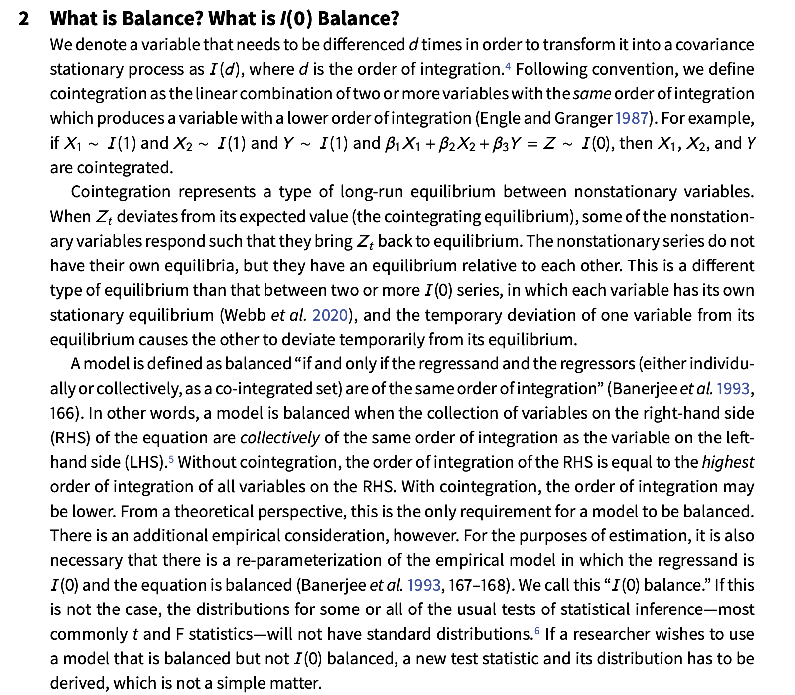
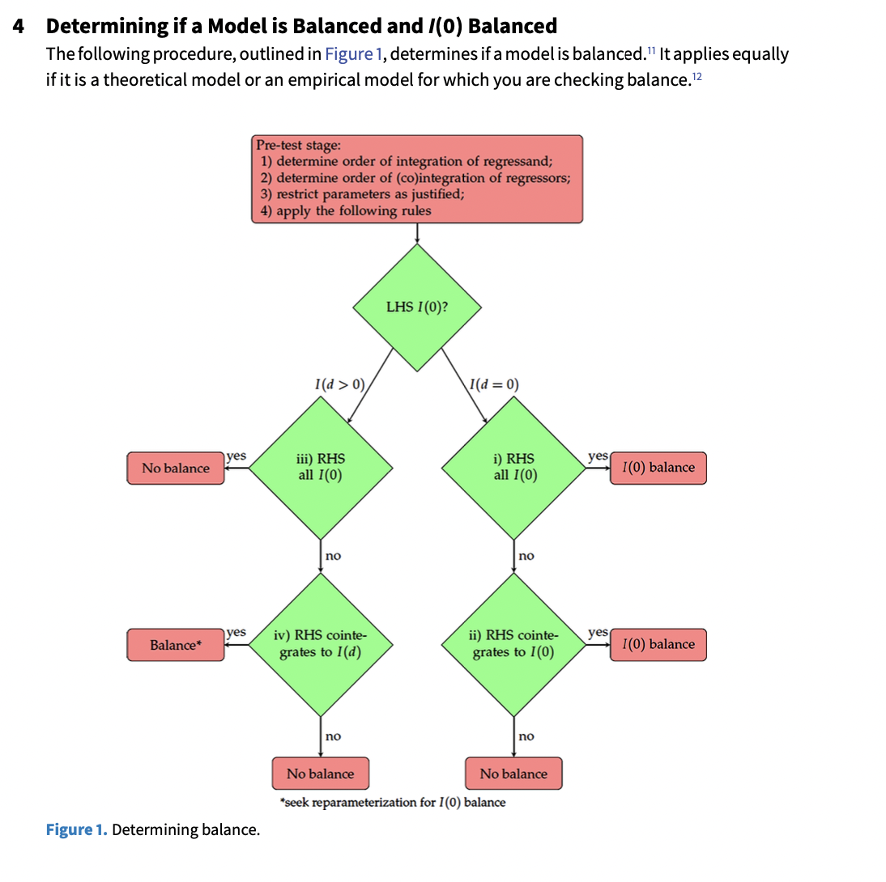

```{r setup, include=FALSE}
knitr::opts_chunk$set(
  cache = FALSE,
  echo = TRUE,
  message = FALSE, 
  warning = FALSE,
  hiline = TRUE
)
library(xaringanthemer); library(kableExtra); library(tidyverse); library(skimr)
```

# Outline for Day 5

1. Background on IV  
2. ARCH/GARCH
3. Other Advances in Time Series
4. Equation Balance


# Day 5: Time Series Grab Bag


## Instrumental Variables

A simple system.

$$y_{1}^{*} = X_{1} \beta_{1} + \alpha_{1} y_{2}^{*} + \epsilon_{1}$$
$$y_{2}^{*} = X_{2} \beta_{2} + \alpha_{2} y_{1}^{*} + \epsilon_{2}$$

- $X_{1}$ and $X_{2}$ are sets of exogenous variables that satisfy rank and order conditions
- $\epsilon_{1}$ and $\epsilon_{2}$ are bivariate normal random errors with
correlation $\rho$, and $\beta$ and $\alpha$ are parameters to be estimated.


# ARCH AND GARCH

## GARCH Models

We are most often concerned with non-stationarity in the mean.

There is an entire suite of models, particularly used in finance applications with high frequency data focused on variance.  These are known as AutoRegressive Conditional Heteroscedasticity Models or ARCH models.

A simple univariate model:

$$y_t = a_0 + a_1 y_{t-1} + e_t$$

where 

$$e_t = v_t h_{t}^{\frac{1}{2}}$$
with $v_t$ as white noise.  Thus, the conditional variance of the series is given by

$$h_t = \alpha_{0} + \alpha_{1} e^{2}_{t-1}$$
## Finding ARCH

1. Estimate some best model for your time series.
1. Isolate residuals and square them -- variance.
1. Estimate a regression of current squared errors on $n$ lags of the prior [squared] error.
1. The test statistic is T (basically N) times $R^2$ is distributed $\chi^2$ with $n$ degrees of freedom under the null hypothesis of no ARCH effects.

## Other Advances

Fractional integration methods.
Switching Models
Structural breaks: see Jong Hee Park's work.
Unit roots in the presence of breaks...


## Equation Balance

:::: {.columns}

::: {.column width="30%"}
Their definition
:::


::: {.column width="70%"}

:::

::::

## How to Use It

:::: {.columns}

::: {.column width="50%"}
Can apply to both the theoretical and the empirical model.
:::

::: {.column width="50%"}

:::

::::

## A Summary Paper to Think About

Andy Phillips has a recent paper on inference in dynamic settings.  It is in the box for day 5.  The paper is:

**How to avoid incorrect inferences (while gaining correct ones) in dynamic models**

## A Key Piece of Homework for the Weekend

[A very short description](https://web.cs.ucla.edu/~kaoru/3-layer-causal-hierarchy.pdf)

# Robust and `, robust`


## 1. The Core Problem: Autocorrelated Errors

Consider the linear regression model:
$$y_t = X_t' \beta + u_t, \quad t = 1, \dots, T$$

### Classical OLS Assumptions Fail
* Under Gauss-Markov, $\mathbb{E}[u u' | X] = \sigma^2 I_T$.
* In time series, errors are often **serially correlated**: $\mathbb{E}[u_t u_s | X] = \gamma_{|t-s|} \neq 0$.

### Consequences
* $\hat{\beta}_{\text{OLS}}$ remains **unbiased and consistent** (assuming exogeneity $\mathbb{E}[X_t u_t] = 0$).
* The classical OLS covariance matrix formula is **invalid**:
  $$\text{Var}(\hat{\beta}_{\text{OLS}} | X) = (X'X)^{-1} \left( X' \Omega X \right) (X'X)^{-1}$$
  where $\Omega = \mathbb{E}[u u' | X]$.
* **Positive autocorrelation** ($\gamma_j > 0$) causes classical OLS standard errors to be severely **underestimated**, leading to inflated $t$-statistics and over-rejection of $H_0$.

---

## 2. Taxonomy of Standard Error "Fixes"

| Approach | Method | Key Idea | Primary Caveat |
| :--- | :--- | :--- | :--- |
| **Robust (HC)** | Huber-White | Adjusts for heteroskedasticity ($\Omega$ diagonal) | Ignores serial correlation ($\gamma_j = 0$) |
| **Non-parametric (HAC)** | **Newey-West** | Smooths sample autocovariances via a kernel | Requires choosing lag bandwidth $m$; poor small-sample performance |
| **Parametric** | FGLS (Cochrane-Orcutt) | Explicitly models $u_t$ as an AR($p$) process | Requires **strict exogeneity**; fails with lagged dependent variables |
| **Resampling** | Block Bootstrap | Resamples contiguous blocks of time series | Sensitivity to block length choice |

---

## 3. The Newey-West (HAC) Estimator

To estimate the middle matrix $\Phi = \frac{1}{T} X' \Omega X = \frac{1}{T} \sum_{t=1}^T \sum_{s=1}^T \mathbb{E}[X_t X_s' u_t u_s]$:

### 1. Long-Run Variance Representation
$$\Phi = \Gamma_0 + \sum_{j=1}^{T-1} \left( \Gamma_j + \Gamma_j' \right), \quad \text{where } \Gamma_j = \frac{1}{T} \sum_{t=j+1}^{T} \mathbb{E}[u_t u_{t-j} X_t X_{t-j}']$$

### 2. The Bartlett Kernel (Newey & West, 1987)
Truncates lags at $m$ and applies linearly decaying weights $w(j, m)$:
$$\hat{\Phi}_{\text{HAC}} = \hat{\Gamma}_0 + \sum_{j=1}^{m} \left( 1 - \frac{j}{m + 1} \right) \left( \hat{\Gamma}_j + \hat{\Gamma}_j' \right)$$

> **Key Theoretical Result:** The Bartlett kernel guarantees that $\hat{\Phi}_{\text{HAC}}$ is **positive semi-definite** (unlike simple unweighted truncated sample autocovariances).

---

## 4. Lag Selection & Alternative Kernels

### Choosing the Truncation Bandwidth ($m$)
* **Trade-off:**
  * $m$ too small $\implies$ persistent autocorrelation omitted $\implies$ downward bias in $SE$.
  * $m$ too large $\implies$ estimates higher lag covariances $\implies$ increased estimator variance.
* **Common Selection Rules:**
  * Heuristic: $m = \lfloor 4 (T/100)^{2/9} \rfloor$ or $m = \lfloor T^{1/4} \rfloor$
  * **Data-driven Bandwidths:** Andrews (1991) and Newey-West (1994) optimal plug-in selectors based on AR(1) approximations.

### Other Non-Parametric Kernels
* **Parzen Kernel:** Cubic decay; smooth downweighting near boundaries.
* **Quadratic Spectral (QS) Kernel:** Asymptotically optimal under Mean Squared Error (MSE) criteria (Andrews, 1991).

---

## 5. Parametric Fixes: FGLS vs. HAC

Instead of adjusting standard errors *post hoc*, we can transform the model to eliminate correlation.

### AR(1) Error Transformation (Cochrane-Orcutt / Prais-Winsten)
Assuming $u_t = \rho u_{t-1} + e_t$, where $e_t \sim \text{i.i.d.}(0, \sigma_e^2)$:
$$(y_t - \rho y_{t-1}) = (X_t - \rho X_{t-1})' \beta + e_t$$

### Theoretical Comparison

* **FGLS Advantage:** Efficient if the AR($p$) model is correctly specified.
* **FGLS Fatal Flaw:** Requires **strict exogeneity** ($\mathbb{E}[u_t | X_1, \dots, X_T] = 0$). If $X_t$ contains lagged dependent variables ($y_{t-1}$), FGLS is **inconsistent**.
* **HAC Advantage:** Valid under **predeterminedness** ($\mathbb{E}[u_t | X_t, X_{t-1}, \dots] = 0$). Allows for dynamic regressors.

---

## 6. Empirical Implementation: OLS vs HAC

::: {.panel-tabset}

### R Execution

```{r}
#| echo: true
#| eval: true
#| message: false
#| warning: false

suppressPackageStartupMessages({
  library(sandwich)
  library(lmtest)
})

# 1. Simulate Time Series Data with AR(1) Errors (rho = 0.7)
set.seed(42)
T_obs <- 200
e <- rnorm(T_obs, mean = 0, sd = 1)
u <- numeric(T_obs)
for (t in 2:T_obs) {
  u[t] <- 0.7 * u[t - 1] + e[t]
}
x <- rnorm(T_obs, mean = 2, sd = 1)
y <- 1.5 + 2.0 * x + u

# 2. Fit OLS Model
model <- lm(y ~ x)

# 3. Naive OLS Standard Errors (Uncorrected)
cat("--- Standard OLS (Understates SE due to AR(1) errors) ---\n")
print(coeftest(model))

# 4. Newey-West HAC Standard Errors (Fixed Lag = 4)
cat("\n--- Newey-West HAC (Lag = 4) ---\n")
print(coeftest(model, vcov = NeweyWest(model, lag = 4, prewhite = FALSE)))

# 5. Newey-West Automatic Bandwidth (Andrews 1991)
cat("\n--- Newey-West HAC (Automatic Andrews Bandwidth) ---\n")
print(coeftest(model, vcov = vcovHAC(model)))
```

### Stata Equivalent

```stata
* ====================================================================
* Stata Code for Comparison (Run in Stata with simulated or real data)
* ====================================================================

* 1. Declare time series structure
* tsset time_var

* 2. Naive OLS
regress y x

* 3. Breusch-Godfrey Test for Serial Correlation
estat bgodfrey, lags(1 2 4)

* 4. Newey-West Standard Errors (Fixed Lag = 4)
newey y x, lag(4)

* 5. Automatic Bandwidth HAC (requires ivreg2 from SSC)
* ssc install ivreg2
ivreg2 y x, bw(auto) kernel(bartlett)

* 6. Quadratic Spectral Kernel (Andrews 1991 Optimal)
ivreg2 y x, bw(auto) kernel(qs)
```

:::

---

## 7. Parametric Models & Diagnostics

::: {.panel-tabset}

### R (FGLS & Diagnostics)

```{r}
#| echo: true
#| eval: true
#| message: false
#| warning: false

suppressPackageStartupMessages({
  library(nlme)
  library(lmtest)
})

# 1. Breusch-Godfrey Test for Serial Correlation in Residuals
bg_test <- bgtest(model, order = 4)
cat("Breusch-Godfrey Test P-Value (Lag 4):", round(bg_test$p.value, 5), "\n\n")

# 2. Feasible Generalized Least Squares (FGLS with AR(1) Errors)
fgls_model <- gls(y ~ x, correlation = corAR1(form = ~ 1))
cat("--- FGLS Estimation (Explicit AR(1) Error Model) ---\n")
summary(fgls_model)$tTable
```

### Stata (Prais-Winsten & Cochrane-Orcutt)

```stata
* ====================================================================
* Stata Parametric FGLS Implementation
* ====================================================================

* 1. Prais-Winsten AR(1) Regression (Preserves first observation)
prais y x, nolog

* 2. Cochrane-Orcutt AR(1) Regression (Drops first observation)
prais y x, corc nolog

* 3. Comparing Standard Errors Side-by-Side in Stata:
* quiet regress y x
* estimates store OLS
* quiet newey y x, lag(4)
* estimates store NW_4
* quiet prais y x, nolog
* estimates store FGLS
* estimates table OLS NW_4 FGLS, se p(%6.4f)
```

:::

---

## 8. Applied Guidelines & Decision Tree

> **Takeaway:** HAC standard errors correct *inference* ($p$-values, confidence intervals); they do **not** fix model misspecification or parameter inconsistency.

### Applied Rules of Thumb
* **Rule 1: Check Dynamic Specification First**
  If lags of $y_t$ or $x_t$ belong in the true relationship, include them explicitly in $X_t$ rather than sweeping dynamics into the error term $u_t$.
* **Rule 2: Use HAC When $T$ is Moderate to Large ($T > 100$)**
  Newey-West / HAC standard errors are asymptotic. In small samples ($T < 50$), HAC standard errors can be severely biased downwards.
* **Rule 3: Beware of FGLS with Lagged Dependent Variables**
  Never use Cochrane-Orcutt or Prais-Winsten if $X_t$ contains $y_{t-1}$. FGLS becomes inconsistent; use HAC or Dynamic OLS/GMM instead.